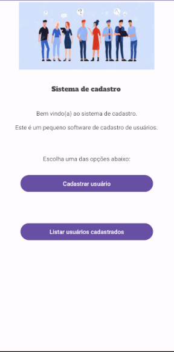
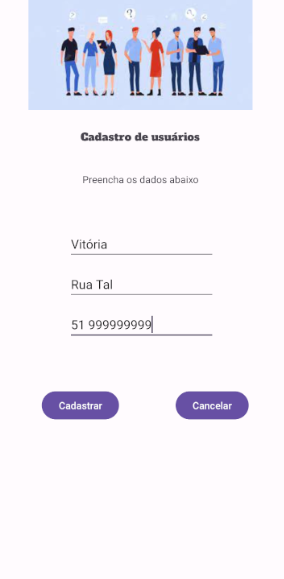

## APP_Sistema_de_cadastro

### SOBRE O PROJETO
- Esse projeto foi pensando para treinar os comandos de mobile, sendo ultilizado com a turma do técnico do CSL.

### LAYOUT DAS TELAS
### Tela 1

### Tela 2

### Tela 3

### Tela 4

### Tela 5

